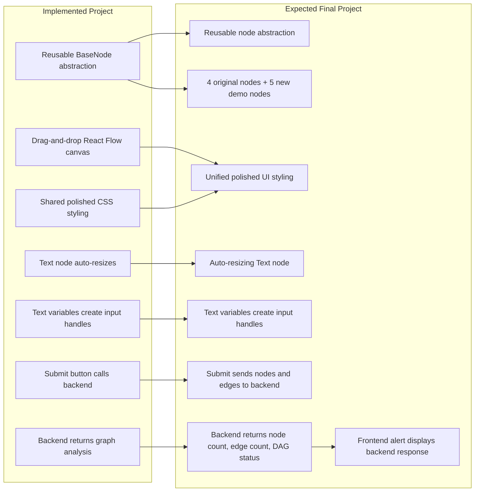
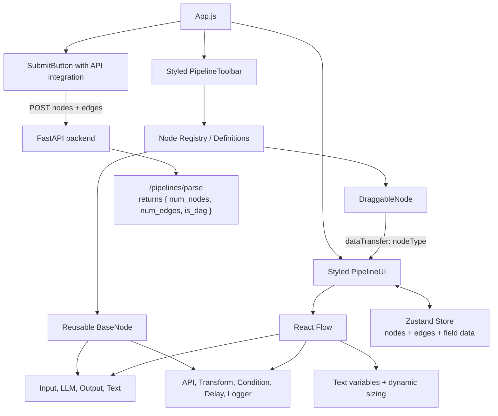
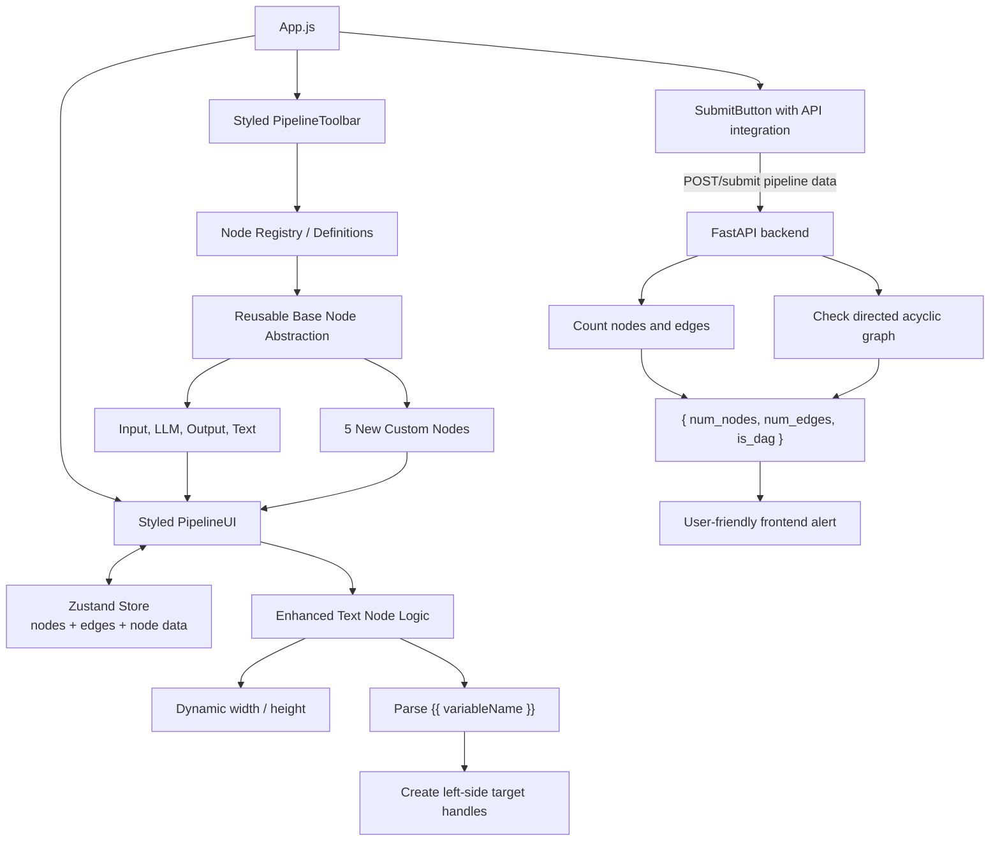
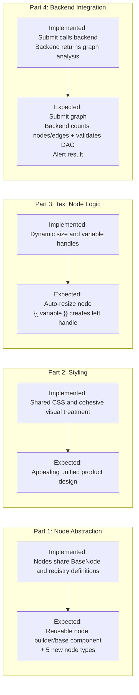
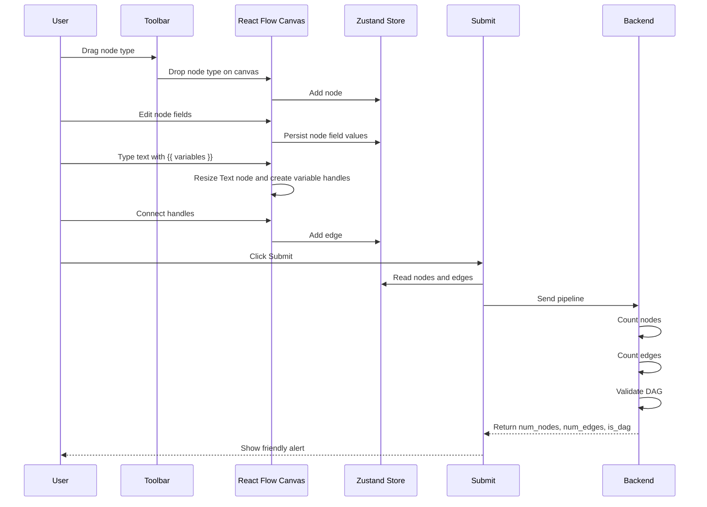
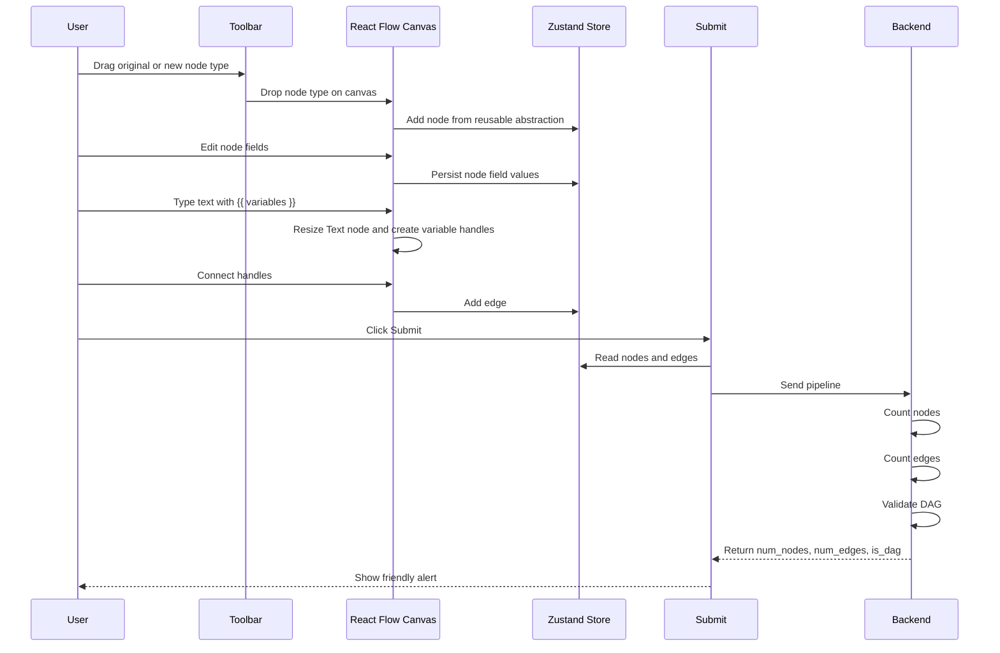
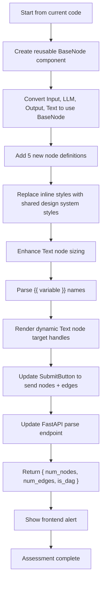
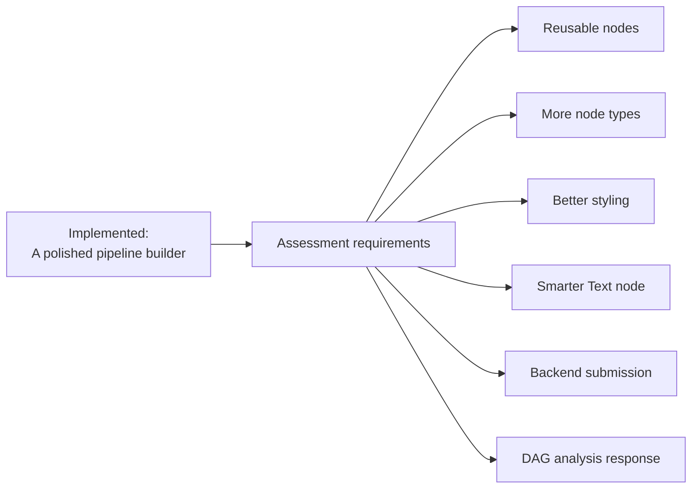

# Current Vs Expected Graphical View

This document compares the implemented project with the expected finished assessment described in the VectorShift frontend technical assessment.

## 1. Big Picture Comparison

## 2. Implemented Architecture

## 3. Expected Architecture

## 4. Assessment Parts As A Gap Map

## 5. Implemented User Flow

## 6. Expected User Flow

## 7. Implementation Roadmap

## 8. Status Matrix

| Area | Current State | Expected State | Status |
| --- | --- | --- | --- |
| Node abstraction | Nodes render through `BaseNode` plus registry definitions | Shared abstraction that makes new nodes easy | Done |
| New nodes | API, Transform, Condition, Delay, Logger added | Five additional custom nodes | Done |
| Styling | Shared CSS for toolbar, canvas, nodes, controls, and submit flow | Cohesive polished UI | Done |
| Text resizing | Text node dimensions respond to content length and line count | Node grows with text content | Done |
| Text variables | `{{variableName}}` tokens become unique left-side handles | Variables create matching left handles | Done |
| Store integration | Node field edits update Zustand node data immutably | Field edits should also persist cleanly | Done |
| Submit button | Sends current nodes and edges as JSON to FastAPI | Sends pipeline to backend | Done |
| Backend parse | Counts nodes, counts edges, and validates DAG with topological sort | Counts nodes, counts edges, validates DAG | Done |
| User result | Browser alert displays `num_nodes`, `num_edges`, and `is_dag` | Alert shows `num_nodes`, `num_edges`, `is_dag` | Done |

## 9. One-Screen Summary

