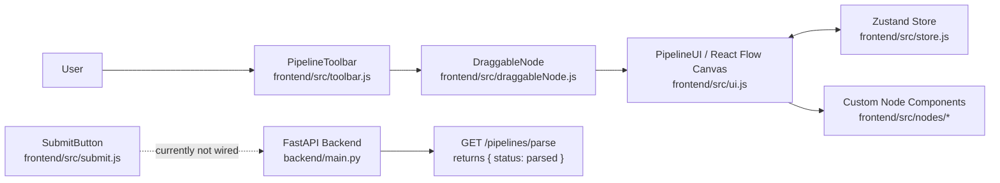
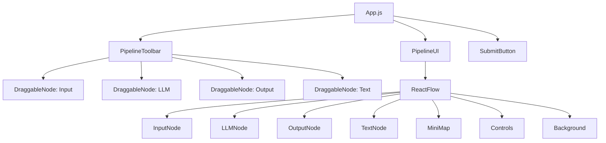
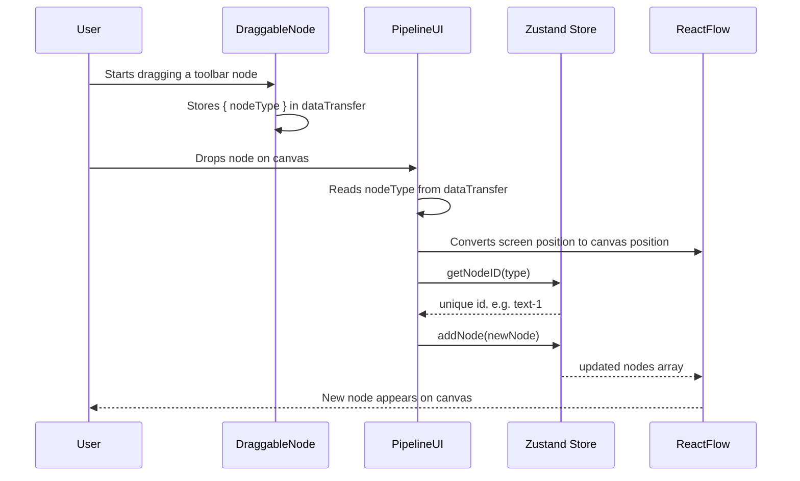
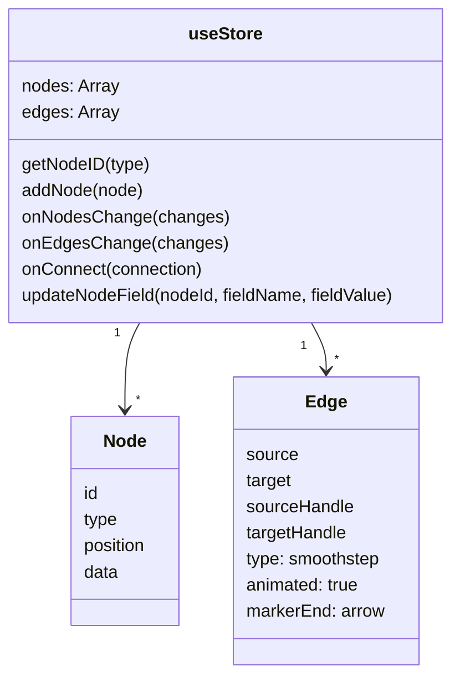
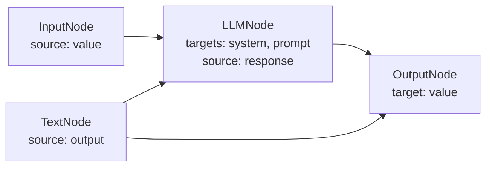
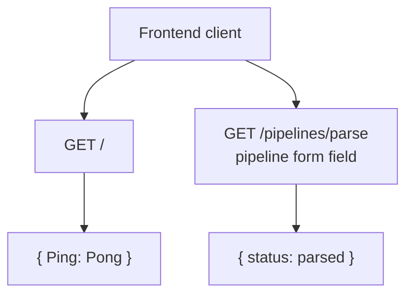
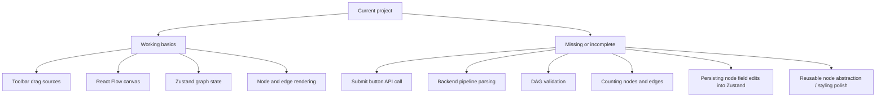

# Project Graphical Explanation

This project is a node-based pipeline builder. The frontend lets users drag node types onto a React Flow canvas and connect them with edges. Zustand stores the graph state. The backend is a minimal FastAPI service with a health route and a placeholder pipeline parsing route.

## 1. System Overview

## 2. Frontend Composition

## 3. Drag And Drop Flow

## 4. State And Graph Model

## 5. Node Types And Handles

| Node | File | Purpose | Handles |
| --- | --- | --- | --- |
| Input | `frontend/src/nodes/inputNode.js` | Defines a named user input with Text/File type | One source handle: `value` |
| LLM | `frontend/src/nodes/llmNode.js` | Represents an LLM processing step | Two target handles: `system`, `prompt`; one source handle: `response` |
| Output | `frontend/src/nodes/outputNode.js` | Defines a named output with Text/Image option | One target handle: `value` |
| Text | `frontend/src/nodes/textNode.js` | Provides a text/template value such as `{{input}}` | One source handle: `output` |

## 6. Backend Shape

The backend exists, but the frontend `SubmitButton` does not currently send graph data to it. The parse endpoint also does not yet analyze nodes, edges, or DAG validity.

## 7. Current Implementation Gaps

## 8. Plain-English Summary

The app is organized around a graph editing loop:

1. The toolbar exposes node templates.
2. A user drags a template onto the canvas.
3. `PipelineUI` creates a React Flow node object with a unique id and position.
4. Zustand stores the node and later stores edges when handles are connected.
5. React Flow renders the graph from the store.
6. The backend is ready to receive pipeline data, but the frontend submission and real parsing logic still need to be implemented.

